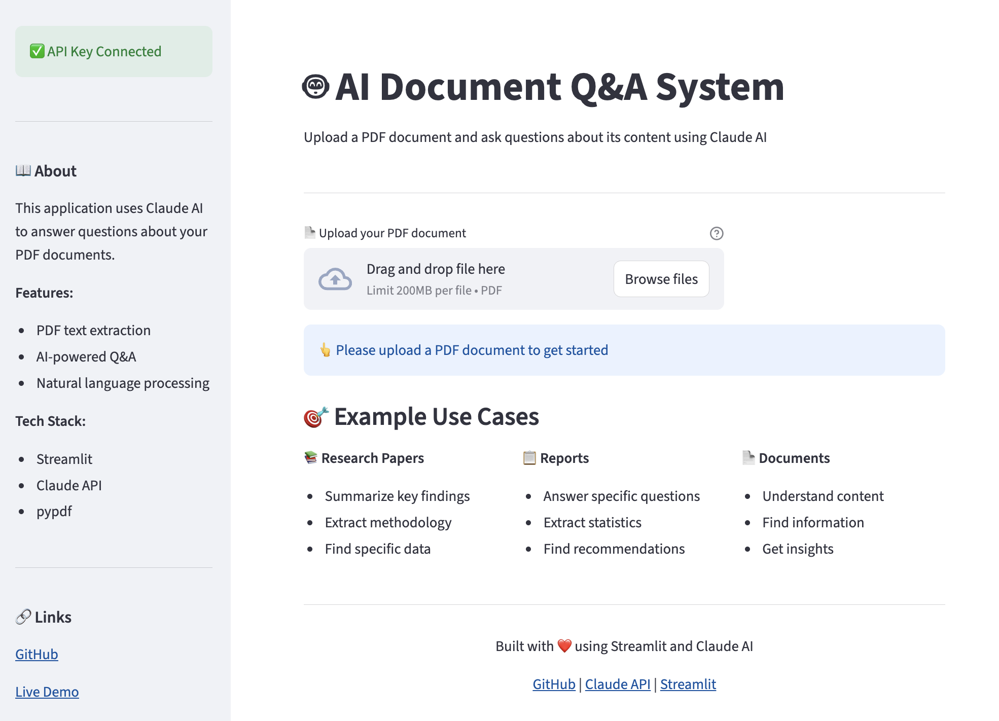

# 🤖 AI Document Q&A System

An intelligent PDF question-answering system powered by Claude AI that enables users to upload documents and get accurate, context-aware answers to their questions.

[](https://ai-document-q-a.streamlit.app)

## ✨ Features

- 📄 **PDF Upload & Processing** - Extract text from PDF documents automatically
- 🤖 **AI-Powered Q&A** - Get intelligent answers based on document content using Claude API
- 💬 **Natural Language Interface** - Ask questions in plain language
- 🔍 **Document Preview** - View extracted text before querying
- 🚀 **Real-time Processing** - Instant responses with streaming support
- 🌐 **Web-based Interface** - No installation required, accessible from anywhere

## 🎯 Live Demo

**[Try it here!](https://ai-document-q-a.streamlit.app)** ✨

## 🛠️ Tech Stack

- **Language**: Python 3.11+
- **Framework**: Streamlit
- **AI Model**: Claude Sonnet 4.6 (Anthropic)
- **PDF Processing**: pypdf
- **Deployment**: Streamlit Cloud
- **Version Control**: Git/GitHub

## 🚀 Getting Started

### Prerequisites

- Python 3.11 or higher
- Claude API key from [Anthropic](https://platform.claude.com)

### Installation

1. **Clone the repository**
```bash
   git clone https://github.com/hangguma/ai-document-qa.git
   cd ai-document-qa
```

2. **Create a virtual environment**
```bash
   python -m venv venv
   source venv/bin/activate  # On Windows: venv\Scripts\activate
```

3. **Install dependencies**
```bash
   pip install -r requirements.txt
```

4. **Set up your API key**
   
   Create a `.streamlit/secrets.toml` file:
```toml
   ANTHROPIC_API_KEY = "your-api-key-here"
```

5. **Run the application**
```bash
   streamlit run app.py
```

6. **Open your browser**
   
   Navigate to `http://localhost:8501`

## 📖 Usage

1. **Upload a PDF** - Click the file uploader and select your PDF document
2. **Preview Content** - Expand the document preview to verify the extracted text
3. **Ask Questions** - Type your question in the input field
4. **Get Answers** - Click "Get Answer" to receive AI-generated responses based on your document

## 🏗️ Project Structure
ai-document-qa/
├── app.py                 # Main application file
├── requirements.txt       # Python dependencies
├── .gitignore            # Git ignore rules
├── .streamlit/
│   └── secrets.toml      # API keys (not tracked)
└── README.md             # Project documentation

## 🔑 API Key Setup

### Getting Your Claude API Key

1. Visit [Anthropic Console](https://platform.claude.com)
2. Sign up or log in
3. Navigate to API Keys section
4. Create a new key
5. Copy and save it securely

### Adding to Local Environment

Create `.streamlit/secrets.toml`:
```toml
ANTHROPIC_API_KEY = "sk-ant-your-key-here"
```

⚠️ **Never commit your API keys to version control!**

## 🌐 Deployment

This app is deployed on Streamlit Cloud. To deploy your own version:

1. Fork this repository
2. Sign up at [Streamlit Cloud](https://share.streamlit.io)
3. Connect your GitHub account
4. Select your repository
5. Add your API key in the Secrets section
6. Deploy!

## 🎨 Screenshots

### Main Interface


## 🔮 Future Enhancements

- [ ] Multi-document support
- [ ] Chat history and session management
- [ ] Source citation for answers
- [ ] Document summarization
- [ ] Support for more file formats (DOCX, TXT)
- [ ] Conversation export functionality
- [ ] Dark mode support

## 🤝 Contributing

Contributions, issues, and feature requests are welcome!

1. Fork the project
2. Create your feature branch (`git checkout -b feature/AmazingFeature`)
3. Commit your changes (`git commit -m 'Add some AmazingFeature'`)
4. Push to the branch (`git push origin feature/AmazingFeature`)
5. Open a Pull Request

## 📝 License

This project is [MIT](LICENSE) licensed.

## 👤 Author

hangguma

- GitHub: [@hangguma](https://github.com/hangguma)

## 🙏 Acknowledgments

- [Anthropic](https://www.anthropic.com) for Claude API
- [Streamlit](https://streamlit.io) for the amazing framework
- [pypdf](https://github.com/py-pdf/pypdf) for PDF processing

## 📞 Support

If you have any questions or need help, please open an issue or contact me directly.

---

⭐ If you found this project helpful, please consider giving it a star!